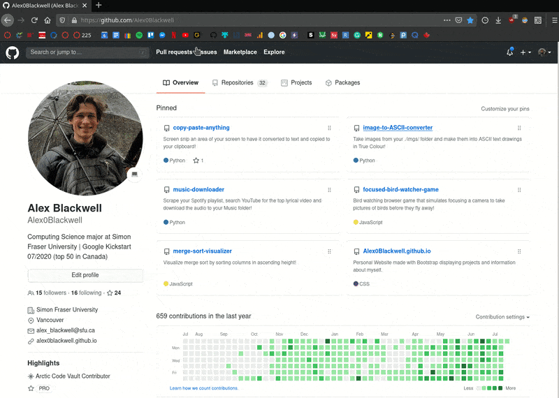
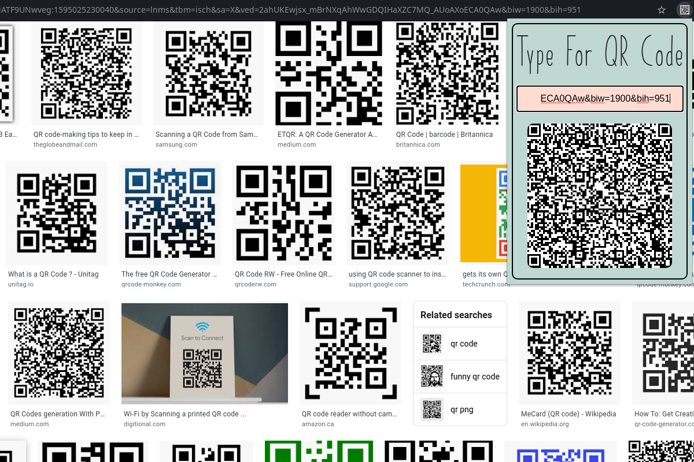

# QR-Code Extension

## Table of contents
* [Overview](#overview)
* [Examples](#examples)
* [Technologies](#technologies)
* [Setup](#setup)
* [Limitations](#limitations)

## Overview
Create QR-Codes without ever leaving your website! Press the extension icon to enter text that is converted in real time to a QR-Code as you type. The extension is conveniently placed to transfer text data such as URL links, usernames, and passwords to your phone.

## Examples

> Video of QR-Code Converter

> Transfer usernames to your phone

> Transfer links to your phone

## Technologies
- **HTML / CSS**
- **JavaScript**
- **Chrome Web Store Development**

## Setup

### Use the Extension

To use the extension without editing it, download the Chrome extension [here](https://chrome.google.com/webstore/detail/qr-code-generator/enjcphliddmdkmgolkmkkkdnldidhgml?hl=en-GB&authuser=0).

Alternatively, to use the extension on Firefox, download the extension [here](https://addons.mozilla.org/en-US/firefox/addon/qr-code-converter/).

### Edit the Code

To edit this code and customize it yourself on Chrome, the latest build on can be downloaded from [releases](https://github.com/Alex0Blackwell/qr-code-extension/releases "Go to releases").  

Here the file can be unzipped and added to **Chrome** by:

    Chrome: Extensions > Load unpacked > "load unzipped folder"

Alternatively, the file can be unzipped and added to **Firefox** by following the steps below:

1. Visit `about:debugging`
2. Press "This Firefox"
3. Select "Load Temporary Add-on..."
4. Navigate to the unzipped release file

Now the QR-Code Converter will run the downloaded version and it may be edited.

## Limitations
- QR-Codes can only represent text.
- The amount of text that can be represented by a QR-Code is limited by the size of the QR-Code itself *(1056 characters in this case)*.

## License
Licensed under the [GNU General Public License v3.0](LICENSE).
